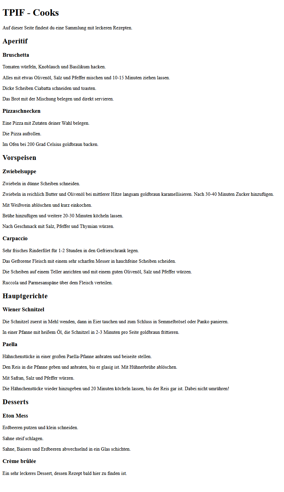

# Das HTML-Grundgerüst

## Was ist HTML?

HTML steht für Hypertext Markup Language.
Es handelt sich hierbei um eine Sprache, welche Informationen zu einem Text hinzufügt, um diesen als Internetseite anzuzeigen.

## Wie werden HTML-Seiten erstellt?

Eine HTML-Seite kann mit jedem beliebigen Texteditor erstellt werden.
Wir werden zu Beginn mit Notepad arbeiten, da dieser auf jeder Windows-Version verfügbar ist.

Wichtig ist hierbei, die Datei mit der Dateiendung **.html** zu speichern.
Achtung, Notepad hängt noch die Endung **.txt** an, wenn als Dateityp nich **Alle Dateien** ausgewählt wird.

## Das Grundgerüst

Das HTML-Grundgerüst besteht aus mehreren Elementen.
Es handelt sich hierbei um die sogenannten HTML-Elemente.

Ein HTML-Element besteht in der Regel aus einem öffnendem Tag (opening tag), dem Inhalt und einem schließenden Tag (closing tag).
Ein Tag ist ein Schlüsselwort, welches sich zwischen den Zeichen "<" und ">" befindet.
Beim schließenden Tag steht vor dem Schlüsselwort noch ein Schrägstrich (slash) "/".

Beispiel: ´<html></html>´ Dies ist das html Element, welchs in diesem Fall keinen Inhalt hat.

Wir werden die Tags immer klein schreiben.

### Um was handelt es sich.

In der ersten Zeile einer HTML Datei befindet sich immer eine Zeile, welche beschreibt, um welchen Typ von Date es sich handelt.
Dies ist der sogenannte Doctype.

```html
<!DOCTYPE html>
```

Achte auf das Ausrufezeichen!
Das "html" besagt, dass es sich um HTML-Code in der Version 5 handelt.

### Die Seite (html)

Das html Element beinhaltet den ganzen Inhalt deiner Seite und muss immer vorhanden sein.
```html
<!DOCTYPE html>
<html>
  Hier kommt der Inhalt
</html>
```

Das öffnende Tag kommt immer direkt nach dem Doctype und das schließende Tag ist immer die letzte Zeile.

Alle weiteren Elemente befinden sich innerhalb des html Elements.

### Der Kopf (head)

Das **head** Element beinhaltet den nicht sichtbaren Teil der Seite.
Hier befinden sich Informationen zu deiner Seite.
welche genau dies sind siehst du weiter unten.

```html
<!DOCTYPE html>
<html>
  <head>
  </head>
</html>
```

### Der Titel (titel)

Das **titel** Element dient dazu deiner Seite einen Namen zu geben.
Dieses befindet sich im Kopf der Seite und somit im nicht sichtbaren Teil.
Diese Information wird aber von deinem Browser benutzt, um zum Beispiel den Tab zu benennen.

```html
<!DOCTYPE html>
<html>
  <head>
    <title>Mein Titel</title>
  </head>
</html>
```

Jede Internetseite muss einen Titel besitzen.

### Das Sichtbare (body)

Das **body** Element ist der sichtbare Teil der Internetseite.
Hier kommt der gesamte Inhalt, der angezeigt werden soll hinein.

```html
<!DOCTYPE html>
<html>
  <head>
    <title>Mein Titel</title>
  </head>
  <body>
    Sichtbarer Teil der Internetseite.
  </body>
</html>
```

Dies ist das Grundgerüst einer HTML-Datei.
Jedes dieser Elemente muss vorhanden sein!

📝Teste dies aus, indem du den obigen Code in den Notepad kopierst und die Datei als "index.html" abspeicherst.
Achte darauf, dass es sich um eine HTML-Datei handelt und nicht um eine Textdatei!

## Aufgaben

Wir werden eine Internetseite schreiben, auf der sich ein Rezeptbuch befindet.
Diese werden wir im Laufe der nächsten Aufgaben nach für nach aufbauen.

 1. Erstelle in diesem Repository die Datei **index.html** im Notepad.
 2. Erstelle in dieser die Grundstruktur einer Internetseite.
 3. Füge folgende Informationen hinzu:
    - Der Inhalt der Internetseite ist auf Deutsch geschrieben,
    - Der Titel lautet **TPIF - Cooks**,
    - Der Zeichensatz der Datei ist UTF-8,
    - Füge dich als Autor auf die Internetseite hinzu,
    - Füge als Beschreibung folgendes hinzu: "Eine Sammlung leckerer Rezepte"
    - Die Schlüsselwörter für die Internetseite sind folgende:
        - rezepte,
        - recipes,
        - kochen,
        - cooking
 4. Die Internetseite soll aussehen wie im folgenden Bild:
    

    Nutze die Richtigen Elemente, für die Überschriften, sowie für den Text.
 6. Teste deine Internetseite im Browser deiner Wahl.
 7. Validiere deinen Code mithilfe des W3C Validators.
